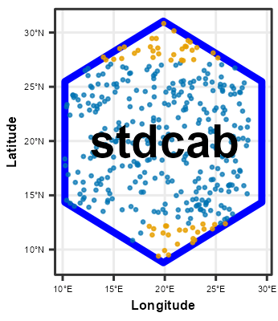
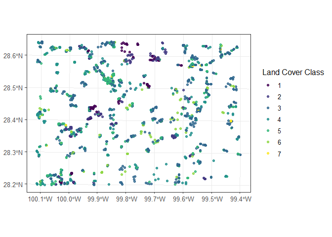
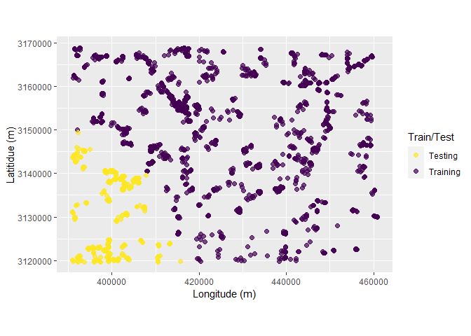

<!-- README.md is generated from README.Rmd. Please edit that file -->



# stdcab

<!-- badges: start -->

[](https://github.com/suvedimukti/stdcab/actions/workflows/R-CMD-check.yaml)
<!-- badges: end -->

The goal of the **stdcab** package is to apply spatial thinning on
multi-class spatial point data, spatial cluster analysis for random and
repeated cross-validations which partitions data into training and
testing set compatible to tidy-modeling resamples. The package allows to
run semivariance analysis, plotting and spatial blocking of
observations.

# Installation

You can install the released version of stdcab from
[CRAN](https://cran.r-project.org) with:

``` r
install.packages("stdcab")
```

To install the latest stdcab version from [GitHub](https://github.com/)
use:

``` r
remotes::install_github('suvedimukti/stdcab')
```

Repeated Cluster CV: `rsample` compatible

This function is extended based on `spatial_cluster_sample`, which is a
wrapper around `spatial_clustering_cv` function of **sptialsample**
package.

## Load dataset

``` r
# load dataset
library(stdcab)

data(landcover)

# create another dataset based on landcover data that comes with the package
#
dspatial <- landcover

# examine data
head(dspatial)
#> Simple feature collection with 6 features and 32 fields
#> Geometry type: POINT
#> Dimension:     XY
#> Bounding box:  xmin: 392210.5 ymin: 3119625 xmax: 399267.2 ymax: 3119778
#> Projected CRS: NAD83 / UTM zone 14N
#>       MBLU      MDIS     MENT      MGRN      MHOM      MNDSI     MNDVI
#> 1 66.63188 1.6617853 2.950356  79.29950 0.4467591 0.27364541 0.3530703
#> 2 63.39825 1.9870977 2.960603  73.69209 0.4019742 0.29720028 0.4029944
#> 3 69.88172 1.6976533 2.942974  80.93514 0.4405100 0.22758467 0.2885415
#> 4 90.20121 1.1538607 2.595928 101.55721 0.5584459 0.08908733 0.0774211
#> 5 92.37401 0.9766353 2.472715 101.19852 0.6005212 0.04736083 0.0158674
#> 6 63.28209 1.6095205 2.905691  78.96302 0.4605569 0.32877674 0.4410174
#>        MNDWI     MNIR     MPC1     MPC2    MPC23      MRED      MSAVI     MSTD
#> 1 0.51515239 138.9199 159.1613 102.4536 202.6218  66.55164 0.51515239 21.25050
#> 2 0.55808490 137.4047 148.8866 104.3592 204.5810  58.23234 0.55808490 19.98415
#> 3 0.43974239 128.5910 161.2001 102.6947 190.8658  71.33220 0.43974239 21.58185
#> 4 0.13333992 121.6026 200.3034 100.9832 169.4937 104.52521 0.13333992 26.70559
#> 5 0.02596568 111.4324 200.0531 100.8161 158.5089 108.05662 0.02596568 26.70048
#> 6 0.60552987 156.1672 159.4131 102.6292 221.1018  60.83709 0.60552987 21.32887
#>        SAVG       SAVI     SBLU      SDIS      SENT      SGRN      SHOM
#> 1 0.7719360 0.09421593 8.007267 0.7173829 0.2979607 13.223900 0.1305707
#> 2 1.0951935 0.15705697 9.696568 0.9694563 0.3330230 13.901611 0.1387346
#> 3 0.8193193 0.10658609 7.640749 0.7711866 0.2884212 11.779700 0.1295736
#> 4 0.6762000 0.12961513 8.087468 0.6171818 0.4649801  9.553970 0.1582553
#> 5 0.5402425 0.09479591 5.684382 0.5020353 0.4690081  6.982191 0.1469829
#> 6 1.0425932 0.09469646 8.115348 0.8179208 0.3255548 11.952452 0.1369844
#>       SHPI      SNDSI      SNDVI      SNIR     SPC1      SPC2     SPC3     SRED
#> 1 2.064817 0.06072264 0.09421593 19.990943 22.00438 17.457164 3.453199 13.53963
#> 2 2.818856 0.09894260 0.15705697 26.054171 24.42861 25.079633 4.042181 17.20263
#> 3 2.515565 0.05936204 0.10658609 16.465150 20.52350 14.532001 4.098715 14.22547
#> 4 2.451424 0.05418211 0.12961513 12.712686 18.92016 12.433632 3.768943 14.64595
#> 5 1.591254 0.04073361 0.09479591  9.757403 13.83072  8.766206 3.414756 10.42752
#> 6 1.975009 0.06062318 0.09469646 18.062159 20.22403 16.856885 3.163099 13.56793
#>       SSTD                 geometry Class_name
#> 1 2.182833 POINT (392210.5 3119625)          4
#> 2 2.590231 POINT (395942.6 3119661)          4
#> 3 1.982273   POINT (393647 3119704)          4
#> 4 2.066033 POINT (397385.1 3119726)          3
#> 5 1.399689 POINT (397434.5 3119731)          3
#> 6 2.185156 POINT (399267.2 3119778)          4

# Class_name is the dependent (response ) data with seven classes (1 through  7)
```

## Visualize the data

``` r
# load ggplot 2 for visualization
library(ggplot2)
ggplot(data = dspatial)+
  geom_sf(aes(colour = factor(Class_name)), size = 1.5, alpha = 0.8)+
  scale_colour_viridis_d()+
  labs(color = "Land Cover Class")+
  theme_bw(12)
```



## Apply repeated cluster sampling on sf data

To make visualization easy lets make five folds and five repeats
resulting 25 splits of data based on **kmeans** clustering.

``` r
# setting seeds
set.seed(1318)

spc_rcv <- repeated_spatial_cluster_sample(data = dspatial, v = 5, repeats = 5,
                            coords = NULL, spatial = TRUE, clust_method = "kmeans", 
                            dist_clust = NULL)
#> Warning: package 'sf' was built under R version 4.3.1
#> Linking to GEOS 3.11.2, GDAL 3.6.2, PROJ 9.2.0; sf_use_s2() is TRUE
#> Warning: package 'sp' was built under R version 4.3.1
#> The legacy packages maptools, rgdal, and rgeos, underpinning the sp package,
#> which was just loaded, will retire in October 2023.
#> Please refer to R-spatial evolution reports for details, especially
#> https://r-spatial.org/r/2023/05/15/evolution4.html.
#> It may be desirable to make the sf package available;
#> package maintainers should consider adding sf to Suggests:.
#> The sp package is now running under evolution status 2
#>      (status 2 uses the sf package in place of rgdal)

spc_rcv
#> # A tibble: 25 × 3
#>    splits             id      id2  
#>    <list>             <chr>   <chr>
#>  1 <split [1503/419]> Repeat1 Fold1
#>  2 <split [1632/290]> Repeat1 Fold2
#>  3 <split [1573/349]> Repeat1 Fold3
#>  4 <split [1353/569]> Repeat1 Fold4
#>  5 <split [1627/295]> Repeat1 Fold5
#>  6 <split [1331/591]> Repeat2 Fold1
#>  7 <split [1648/274]> Repeat2 Fold2
#>  8 <split [1482/440]> Repeat2 Fold3
#>  9 <split [1654/268]> Repeat2 Fold4
#> 10 <split [1573/349]> Repeat2 Fold5
#> # ℹ 15 more rows
```

## Visualize clusters

Following chunk of code is a function to run each split at a time to
visualize `Analysis\Training` and `Assessment\Testing` set in each fold
and repeats.

``` r
library(magrittr) # 
#> 
#> Attaching package: 'magrittr'
#> The following object is masked from 'package:purrr':
#> 
#>     set_names
fplot_splits <- function(split) {
  gp <- analysis(split) %>%
   dplyr::mutate(analysis = "Training") %>%
   dplyr::bind_rows(assessment(split) %>%
   dplyr::mutate(analysis = "Testing")) %>%
    ggplot(aes(X, Y, color = analysis)) +
    geom_point(alpha = 0.7, size = 2) +
    coord_fixed() +
    labs(color = "Train/Test") +
    scale_color_viridis_d(direction = -1) +
    xlab("Longitude (m)") +
    ylab("Latitidue (m)")
  print(gp)
}
```

## Plotting

``` r
# plot using walk function from purrr package
# this requires gifski package
purrr::walk(spc_rcv$splits, fplot_splits)
```


