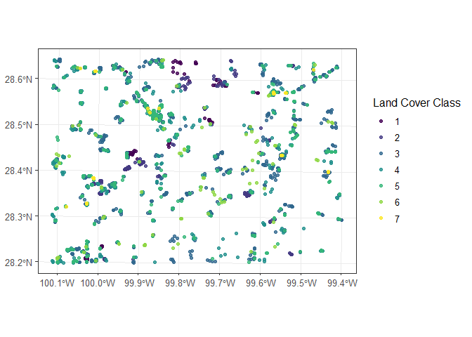
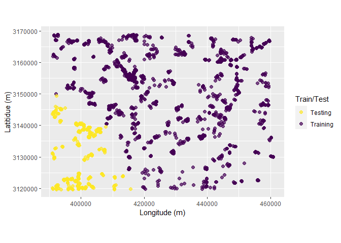

<!-- README.md is generated from README.Rmd. Please edit that file -->

# stdcab

<!-- badges: start -->

[](https://mybinder.org/v2/gh/suvedimukti/stdcab/master)
[](https://CRAN.R-project.org/package=stdcab)
[](https://lifecycle.r-lib.org/articles/stages.html#experimental)
[](https://travis-ci.com/suvedimukti/stdcab)
<!-- badges: end -->

The goal of the **stdcab** package is to apply spatial thinning on
multi-class spatial point data, spatial cluster analysis for random and
repeated cross-validations which partitions data into training and
testing set compatible to tidy-modeling resamples. The package allows to
run semivariance analysis, plotting and spatial blocking of
observations.

# Installation

You can install the released version of stdcab from
[CRAN](https://cran.r-project.org) with:

`{r install install.packages("stdcab")`

# Repeated Cluster CV: Rsample compatible

This function is extended based on `spatial_cluster_sample`, which is a
wrapper around `spatial_clustering_cv` function of **sptialsample**
package.

## Load dataset

``` r
# load dataset
library(stdcab)
#> Loading required package: sf
#> Linking to GEOS 3.9.1, GDAL 3.2.1, PROJ 7.2.1; sf_use_s2() is TRUE
data(landcover)
# create another dataset based on landcover data that comes with the packge
#
dspatial<- landcover

# examine data
head(dspatial)
#> Simple feature collection with 6 features and 42 fields
#> Geometry type: POINT
#> Dimension:     XY
#> Bounding box:  xmin: 392210.5 ymin: 3119625 xmax: 399267.2 ymax: 3119778
#> Projected CRS: NAD83 / UTM zone 14N
#>   Class_name      ASYM     BDRI    COMPT     DENS       MASM     MAVG     MAXD
#> 1          4 0.7314657 1.884956 1.914278 1.958027 0.06211513 1.866592 3.359076
#> 2          4 0.7789210 2.593156 2.364084 1.703363 0.06226670 2.062140 3.498545
#> 3          4 0.5165840 2.447257 1.946576 2.038557 0.06229337 1.836628 3.201589
#> 4          3 0.3670303 2.425428 2.441741 2.074016 0.09680321 1.316488 3.043043
#> 5          3 0.4476154 1.558442 1.458198 2.201853 0.10974729 1.121580 3.096424
#> 6          4 0.5593492 1.931818 1.825390 2.039608 0.06591540 1.843113 3.552618
#>       MBLU      MDIS     MENT      MGRN      MHOM      MNDSI     MNDVI
#> 1 66.63188 1.6617853 2.950356  79.29950 0.4467591 0.27364541 0.3530703
#> 2 63.39825 1.9870977 2.960603  73.69209 0.4019742 0.29720028 0.4029944
#> 3 69.88172 1.6976533 2.942974  80.93514 0.4405100 0.22758467 0.2885415
#> 4 90.20121 1.1538607 2.595928 101.55721 0.5584459 0.08908733 0.0774211
#> 5 92.37401 0.9766353 2.472715 101.19852 0.6005212 0.04736083 0.0158674
#> 6 63.28209 1.6095205 2.905691  78.96302 0.4605569 0.32877674 0.4410174
#>        MNDWI     MNIR     MPC1     MPC2    MPC23      MRED      MSAVI     MSTD
#> 1 0.51515239 138.9199 159.1613 102.4536 202.6218  66.55164 0.51515239 21.25050
#> 2 0.55808490 137.4047 148.8866 104.3592 204.5810  58.23234 0.55808490 19.98415
#> 3 0.43974239 128.5910 161.2001 102.6947 190.8658  71.33220 0.43974239 21.58185
#> 4 0.13333992 121.6026 200.3034 100.9832 169.4937 104.52521 0.13333992 26.70559
#> 5 0.02596568 111.4324 200.0531 100.8161 158.5089 108.05662 0.02596568 26.70048
#> 6 0.60552987 156.1672 159.4131 102.6292 221.1018  60.83709 0.60552987 21.32887
#>        RECT     ROUND       SASM      SAVG       SAVI     SBLU      SDIS
#> 1 0.8191112 0.7296381 0.02446373 0.7719360 0.09421593 8.007267 0.7173829
#> 2 0.7356428 1.7678295 0.02781958 1.0951935 0.15705697 9.696568 0.9694563
#> 3 0.7372122 1.0186282 0.02287383 0.8193193 0.10658609 7.640749 0.7711866
#> 4 0.7245784 1.2547544 0.05445677 0.6762000 0.12961513 8.087468 0.6171818
#> 5 0.8812891 0.7277193 0.06013737 0.5402425 0.09479591 5.684382 0.5020353
#> 6 0.7646652 1.3670547 0.02732812 1.0425932 0.09469646 8.115348 0.8179208
#>        SENT      SGRN      SHOM     SHPI      SNDSI      SNDVI      SNIR
#> 1 0.2979607 13.223900 0.1305707 2.064817 0.06072264 0.09421593 19.990943
#> 2 0.3330230 13.901611 0.1387346 2.818856 0.09894260 0.15705697 26.054171
#> 3 0.2884212 11.779700 0.1295736 2.515565 0.05936204 0.10658609 16.465150
#> 4 0.4649801  9.553970 0.1582553 2.451424 0.05418211 0.12961513 12.712686
#> 5 0.4690081  6.982191 0.1469829 1.591254 0.04073361 0.09479591  9.757403
#> 6 0.3255548 11.952452 0.1369844 1.975009 0.06062318 0.09469646 18.062159
#>       SPC1      SPC2     SPC3     SRED     SSTD                 geometry
#> 1 22.00438 17.457164 3.453199 13.53963 2.182833 POINT (392210.5 3119625)
#> 2 24.42861 25.079633 4.042181 17.20263 2.590231 POINT (395942.6 3119661)
#> 3 20.52350 14.532001 4.098715 14.22547 1.982273   POINT (393647 3119704)
#> 4 18.92016 12.433632 3.768943 14.64595 2.066033 POINT (397385.1 3119726)
#> 5 13.83072  8.766206 3.414756 10.42752 1.399689 POINT (397434.5 3119731)
#> 6 20.22403 16.856885 3.163099 13.56793 2.185156 POINT (399267.2 3119778)

# Class_name is the dependent (response ) data with seven classes (1 through  7)
```

## Visualize the data

``` r
# load ggplot 2 for visualization
library(ggplot2)
ggplot(data = dspatial)+
  geom_sf(aes(colour = factor(Class_name)), size = 1.5, alpha = 0.8)+
  scale_colour_viridis_d()+
  labs(color = "Land Cover Class")+
  theme_bw(12)
```



## Apply repeated cluster sampling on sf data

To make visualization easy lets make five folds and five repeats
resulting 25 splits of data based on **kmeans** clustering.

``` r
set.seed(1318)

spc_rcv<- repeated_spatial_cluster_sample(data = dspatial, v = 5, repeats = 5,
                            coords = NULL, spatial = TRUE, clust_method = "kmeans", 
                            dist_clust = NULL)

spc_rcv
#> # A tibble: 25 x 3
#>    splits             id      id2  
#>    <list>             <chr>   <chr>
#>  1 <split [1503/419]> Repeat1 Fold1
#>  2 <split [1632/290]> Repeat1 Fold2
#>  3 <split [1573/349]> Repeat1 Fold3
#>  4 <split [1353/569]> Repeat1 Fold4
#>  5 <split [1627/295]> Repeat1 Fold5
#>  6 <split [1331/591]> Repeat2 Fold1
#>  7 <split [1648/274]> Repeat2 Fold2
#>  8 <split [1482/440]> Repeat2 Fold3
#>  9 <split [1654/268]> Repeat2 Fold4
#> 10 <split [1573/349]> Repeat2 Fold5
#> # ... with 15 more rows
```

## Visualize clusters

Following chunk of code is a function to run each split at a time to
visualize `Analysis` or Training and Assessment or Testing set in each
fold and repeats.

``` r
library(magrittr) # 
#> 
#> Attaching package: 'magrittr'
#> The following object is masked from 'package:purrr':
#> 
#>     set_names
fplot_splits <- function(split) {
  gp <- analysis(split) %>%
   dplyr::mutate(analysis = "Training") %>%
   dplyr::bind_rows(assessment(split) %>%
   dplyr::mutate(analysis = "Testing")) %>%
    ggplot(aes(X, Y, color = analysis)) +
    geom_point(alpha = 0.7, size = 2) +
    coord_fixed() +
    labs(color = "Train/Test") +
    scale_color_viridis_d(direction = -1) +
    xlab("Longitude (m)") +
    ylab("Latitidue (m)")
  print(gp)
}
```

## Plotting

``` r
# plot using walk function from purrr package
purrr::walk(spc_rcv$splits, fplot_splits)
```


