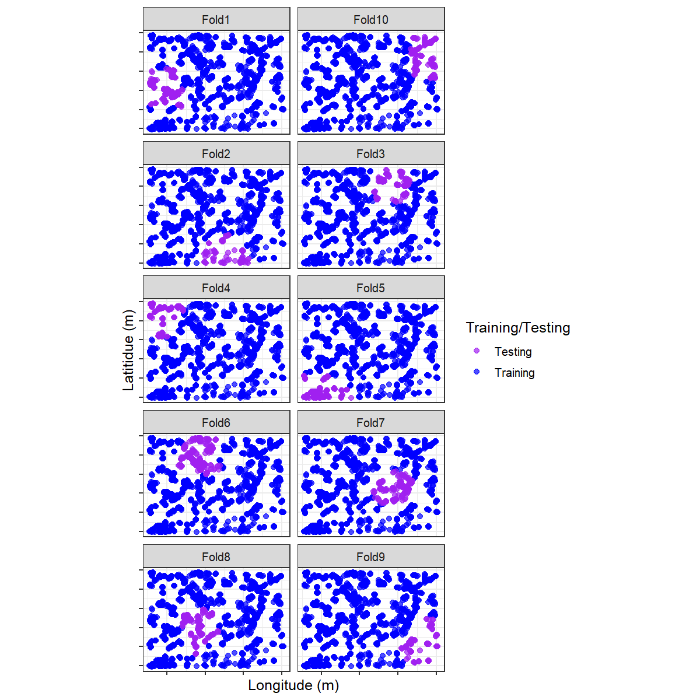

```{r, include = FALSE}
knitr::opts_chunk$set(
  collapse = TRUE,
  comment = "#>"
)
```

```{r setup}
library(stdcab)
```

# Introduction

Ecological data usually have inherent spatial structures; nearer things are 
more similar than distant things. This relationship can exist 
at any spatial scale from local to global with a positive spatial autocorrelation
as a nonzero covariance between spatially proximal observations or proximal values.  

This definition imposes the need for a means to measure, 
based on a sample of data values, the covariance between nearby points and to 
decide whether or not this covariance is consistent with a random spatial 
arrangement of values. Such non-randomness in the data are not problematic. Correlated data allows
to uncover patterns from the process. However, in parametric statistical analysis of 
data problems can arise 1) non-randomness of error; 2) pseudo-replication-if too many observations are
made within the distance at which observations are spatially structured, and 3) As the predictor variables
(Independent or explanatory variables) are often correlated with dependence structures, resulting model 
can over-inflate the model's accuracy by wholly or partially removing residual structures.

Parametric models can address dependence structures in the data (e.g., autoregressive or mixed model), at least in theory. However, in practice, model specification bias together with structural over-fitting, can seriously impair the diagnostic evaluations of the model. Further, well-known popular machine learning models (e.g., random forest) don't allow accounting for such spatial dependence structures. 

## What happens with non-parametric models?

In an ideal model building ( or machine learning), evaluation and validation should be 
performed using independent data. For example, model evaluation data should not come from 
within the same geographic extent from which the model was built (spatially distinct). 
Two scenarios may arise in such cases: 1) either no such independent data exist; usually, 
we tend to focus on collecting data within the spatial extent of our study area. 
In classification problems of remote sensing data, we may collect sample data from on-screen (heads-up) digitization. 
We can't guarantee that the relationship in the data is still the same. 
2) Data set on hand may not meet the assumption of independence.

The current paradigm of evaluation predictive error of machine learning model(s) is 
through cross-validation, usually with the use of hold-out(saving some percent of 
total sample data). The key idea is that the training data is independent of hold-out 
(validation) data. However, training points tend to cluster due to resources or 
time limitations. While it is possible to create independent data apriori, this 
is not usually the case; because we can't be certain independence of data as 
spatial dependence can happen at any scale.

Hold-out data, however, does not necessarily get rid of the problem at hand, 
as testing/validation data can be drawn from a nearby location with a dependence 
structure. Therefore, the resulting model would favor the complex, and 
accuracy metrics would be too optimistic.


## How to deal with it

There are several ways to address the spatial dependency in the data for parametric 
analysis such as autoregressive (AR) models, generalized least squares (GLS) 
and mixed effects models. However, even after such remedial measures, the problem can still exist. Which invites the strategic blocking of observations. The `stdcab` offers two approaches:

1) Clustering: Partitioning and Hierarchical clustering

2) Blocking: Splitting coordinate space into regular grids


# Clustering

Clustering can be done for k-fold cross validation or repeated k-fold cross validation. Two two options are possible 1) partitioning clustering (using coordinates) or 2) hierarchical clustering. 

## Partitioning clustering 

*kmeans* clustering is one of the widely used un-supervised multivariate analysis. 

```{r kmeans}
data("landcover")

# setting seeds

set.seed(1318)

rnd_fold <- spatial_cluster_sample(
  data = landcover, coords = NULL, v = 10,
  spatial = TRUE, clust_method = "kmeans"
)

```

Now a `dataframe()`  of a training and testing data can be created from the list of `splits`
```{r dft}
# create gen_df

gen_df <- function(split) {
  gp <- analysis(split) %>%
    dplyr::mutate(analysis = "Training") %>%
    dplyr::bind_rows(assessment(split) %>%
      dplyr::mutate(analysis = "Testing"))
}

def <- purrr::map_df(rnd_fold$splits, gen_df)

# short-cut to add fold information
vec <- paste0("Fold", 1:10)

# folding information replication
fold <- rep(vec, each = 1922)
# apply fold

def$fold <- fold
```

Visualize training and testing data for each fold using `ggplot2()` package 
folds using ggplot2

```{r checkpackage, message = TRUE, warning = FALSE}
# check packages that are not installed
# it threw error in debian system

pkg <- c("ggplot2", "gganimate")

pkg_check <- lapply(pkg, FUN = function(p) {
  if (!require(p, character.only = TRUE)) {
    install.packages(p, dependencies = TRUE,repos = "http://cran.us.r-project.org")
    library(p, character.only = TRUE)
  }
})

```

```{r visualize,fig.width = 10, fig.height = 8, eval= FALSE}
# remove coordinates to avoid cluttering

blank_xy <- function() {
  theme(
    axis.text.x = element_blank(),
    # axis.ticks.x=element_blank(),
    axis.text.y = element_blank(),
    # axis.ticks.y=element_blank()
  )
}

vis_fold <- ggplot(def, aes(X, Y, color = analysis)) +
  geom_point(alpha = 0.7, size = 2) +
  coord_fixed() +
  theme_bw(base_size = 12) +
  labs(color = "Training/Testing") +
  scale_color_manual(values = c("purple", "blue")) +
  xlab("Longitude (m)") +
  ylab("Latitidue (m)") +
  facet_wrap(facets = vars(fold), nrow = 5, scales = "fixed") +
  blank_xy()

```
```{r exportFig, include = FALSE,warning = FALSE}
# getwd()

```

## Hierarchical Clustering

**spatial_cluster_sample** supports hierarchical clustering using `stats::hclust` function. Unlike, `kmeans` 
hierarchical clustering does not requires the number of k. This version does not support visualizations as to how many distinct clusters are there. Number of clusters and repeats to be used in the **repeated_spatial_cluster_sample** should be informed by the data. Other functionalists will be added in the future release. 

```{r hclust, eval=requireNamespace('gifski', quietly = TRUE), echo=FALSE,fig.height = 8, fig.width=10, include=TRUE}

set.seed(1318)

spc_rhcv <- spatial_cluster_sample(
  data = landcover, v = 10, coords = NULL,
  spatial = TRUE, clust_method = "hclust",
  dist_clust = "ward"
)

head(spc_rhcv, 10)

# examine fold 1 and fold 5

spc_rhcv$splits[[1]]

spc_rhcv$splits[[5]]


# create a data set for visualization of these folds
#------ recall function from above
hdef <- purrr::map_df(spc_rhcv$splits, gen_df)

# fold information is same so lets append

hdef$fold <- fold
```

```{r hclustplot, eval=requireNamespace('gifski', quietly = TRUE), echo=FALSE, fig.height=8, fig.width=10}

knitr::include_graphics(path = "../man/figures/vis_fold_1.png")

```


### Visualize

```{r clustvis, echo = TRUE,eval=FALSE}
p_hclus <- ggplot(hdef, aes(X, Y, color = analysis)) +
  geom_point(alpha = 0.7, size = 2) +
  coord_fixed() +
  theme_bw(base_size = 12) +
  labs(color = "Train/Test") +
  scale_color_manual(values = c("purple", "blue")) +
  xlab("Longitude (m)") +
  ylab("Latitidue (m)") +
  # transition_states(id,state_length = 2)
  labs(
    title =
      "Location {previous_state}"
  ) +
  theme(plot.title = element_text(hjust = 0.5)) +
  gganimate::transition_states(
    states = fold,
    transition_length = 4,
    state_length = 4
  )

```

```{r plotgif, eval=requireNamespace('gifski', quietly = TRUE), echo=FALSE, fig.height=8, fig.width=10}

knitr::include_graphics(path = "../man/figures/p_hclus.gif")

```

# References @

Julia Silge (2021). spatialsample: Spatial Resampling Infrastructure. https://github.com/tidymodels/spatialsample,
  https://spatialsample.tidymodels.org.
  
Legendre, P., 1993. Spatial autocorrelation: problem or new paradigm? Ecology 74, 1659–1673.
Legendre, P., Dale, M.R.T., Fortin, M.-J., Gurevitch, J., Hohn, M., Myers, D., 2002. The consequences of spatial structure for the design and analysis of ecological field surveys. Ecography 25, 601–615.

Legendre, P., Fortin, M.J., 1989. Spatial pattern and ecological analysis.
Miller, J., Franklin, J., Aspinall, R., 2007. Incorporating spatial dependence in predictive vegetation models. Ecol. Modell. 202, 225–242. https://doi.org/10.1016/j.ecolmodel.2006.12.012

Miller, J.R., Turner, M.G., Smithwick, E.A.H., Dent, C.L., Stanley, E.H., 2004. Spatial extrapolation: the science of predicting ecological patterns and processes. BioScience 54, 310–320.

Pebesma, E., 2018. Simple Features for R: Standardized Support for Spatial Vector Data. The R Journal 10 (1), 439-446,
  https://doi.org/10.32614/RJ-2018-009
  
Tobler, W.R., 1970. A computer movie simulating urban growth in the Detroit region. Econ. Geogr. 46, 234–240.

@ not an exhaustive list of references
